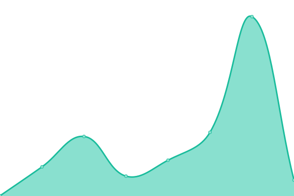

# [📈 Live Status](https://demo.upptime.js.org): <!--live status--> **🟩 All systems operational**

This repository contains the open-source uptime monitor and status page for [Upptime](https://upptime.js.org), powered by [Upptime](https://github.com/upptime/upptime).

With [Upptime](https://upptime.js.org), you can get your own unlimited and free uptime monitor and status page, powered entirely by a GitHub repository. We use [Issues](https://github.com/upptime/upptime/issues) as incident reports, [Actions](https://github.com/KieranHolroyd/monitoring/actions) as uptime monitors, and [Pages](https://demo.upptime.js.org) for the status page.

<!--start: status pages-->
<!-- This summary is generated by Upptime (https://github.com/upptime/upptime) -->
<!-- Do not edit this manually, your changes will be overwritten -->
<!-- prettier-ignore -->
| URL | Status | History | Response Time | Uptime |
| --- | ------ | ------- | ------------- | ------ |
|  [Dough.](https://doughpizza.org) | 🟩 Up | [dough.yml](https://github.com/KieranHolroyd/monitoring/commits/HEAD/history/dough.yml) | 

 259ms
     
 | 

<a href="https://monitoring.kieran.dev/history/dough">100.00%</a>
    

|  [Kieran.dev](https://kieran.dev) | 🟩 Up | [kieran-dev.yml](https://github.com/KieranHolroyd/monitoring/commits/HEAD/history/kieran-dev.yml) | 

 214ms
     
 | 

<a href="https://monitoring.kieran.dev/history/kieran-dev">100.00%</a>
    

|  [Nitrexdesign.co.uk](https://nitrexdesign.co.uk) | 🟩 Up | [nitrexdesign-co-uk.yml](https://github.com/KieranHolroyd/monitoring/commits/HEAD/history/nitrexdesign-co-uk.yml) | 

 227ms
     
 | 

<a href="https://monitoring.kieran.dev/history/nitrexdesign-co-uk">100.00%</a>
    

<!--end: status pages-->

[**Visit our status website →**](https://demo.upptime.js.org)

## 📄 License

- Code: [MIT](./LICENSE) © [Upptime](https://upptime.js.org)
- Data in the `./history` directory: [Open Database License](https://opendatacommons.org/licenses/odbl/1-0/)
